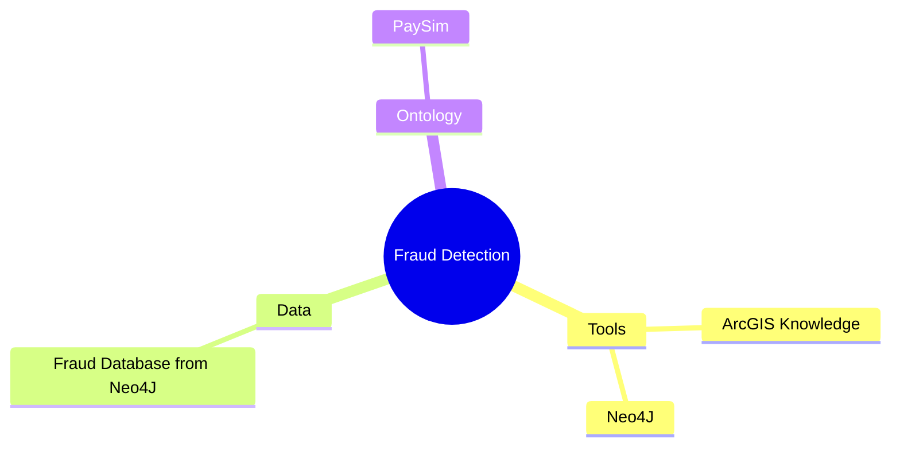
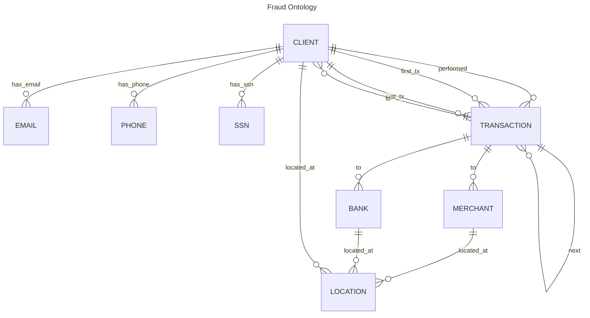
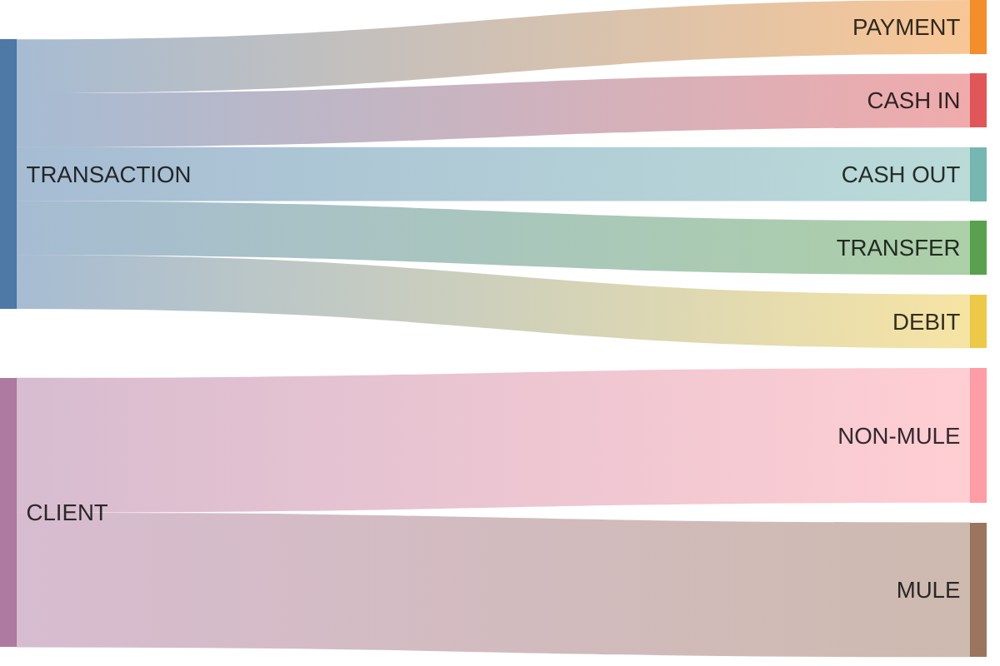

## Introduction

### What is Graph Database?
A graph database is defined as a specialized platform designed for creating and manipulating graphs.

> Based on Gartner's article on Gartner's Impact Radar for Generative AI (2023), Knowledge Graph is included in the model and data development section with high predictions of trends in the near future.
{: .prompt-tip }

_The Positioning of Graph Database._

### Key Concept Graph Database
- __Entity__ is a basic component in a graph database that represents a specific object or individual in the data. 
Examples include people, locations, items.
- __Relation__ is a connection or relationship between two entities in the graph. 
Example of relation: Ownership, The relationship between a person and the things they own.
- __Properties__ are attributes or additional information attached to entities and relations. 
Properties provide more details about the entity or relation. 
Example of property: Name (A property on a person entity, such as "Name: Alice").

_Concept of Graph Database._

### Graph Database vs Relational Database

|  | Graph Database| Relational Database |
|------|--------|--------|
| strength | Flexible Data Model, Scalability, High Performance for Highly Connected Graphs | Suitable for Structured Data Structures, High Data Integrity, Ease in Queries  |
| weakness | Not Suitable for Simple Structured Data, Requires Deeper Understanding | Limited Scalability, Limitations in Data Model, Lack of Flexibility in Schema Changes |

### ArcGIS Knowledge Core Vision in GIS Technology
ArcGIS Knowledge aims to be a strong foundation in GIS technology, enabling users to make better decisions and create more innovative solutions in various geographic contexts.

### Who Are Sectors As Target Market/Users
1. Government
- Example project: Knowing the relationship between flood risk zones and critical infrastructure such as roads, hospitals, and schools for disaster mitigation planning.

2. Energy and Resources Industry
- Example project: Identifying the relationship between oil well locations and concession boundary lines for natural resource exploitation monitoring.

3. Telecommunication Industry
- Example Project: Identify the relationship between cellular phone base station locations and cellular data usage patterns for network capacity planning.

4. Transportation Industry
- Example Project: Analyzing the relationship between traffic congestion points and the location of public transportation facilities for bus or train route optimization.

5. Healthcare
- Example Project: Analysis of the relationship between the location of health facilities and the distribution of certain diseases for the development of community disease prevention strategies.

## General Overview Use Case Fraud Analysis

_Mindmap of this Project_

### What is Fraud in Financial Sectors
Fraud in financial sectors is a deliberate act committed to gain an unauthorized advantage or to deceive another party in the context of a financial transaction or investment.

It involves the use of deceit, manipulation, or other legal violations aimed at circumventing the financial system in a way that harms other people or financial entities.

### Type of Activities Categorized as Fraud in Finance
1. Identity Fraud
- The use of another person's personally identifiable information to open a bank account or conduct financial transactions without their authorization.
2. Market Manipulation
- The manipulation of the price or volume of stocks, currencies, or commodities to gain an unauthorized advantage.

3. Insurance Fraud
- Filing false insurance claims or unlawfully transferring insurance assets.

4. Loan Fraud
- Falsifying documents or information to obtain a loan on more favorable terms or to avoid repayment of a loan.

5. Money Laundering
- The process of disguising the origin of illegal funds by falsely or unlawfully inserting them into the financial system.

## Fraud in Knowledge Graph 

1. __Entities__:
- Debit: Transaction of deducting funds from an account.
- Payment: Payment for products or services.
- CashIn: Cash deposit to an account.
- CashOut: Cash withdrawal from the account.
- Transfer: Transfer of funds between accounts.
- Bank: The financial institution where the transaction takes place.
- Merchant: The seller who receives the payment.
- Client: The customer who makes the transaction.
- Mule: Individuals used to move funds from fraud.
- Email: The email address used by the entity.
- SSN: The Social Security Number associated with the entity.
- Phone: The phone number associated with the entity.
- Location: The location of the client, bank, and merchant.

2. __Relationships__:
- TO: Indicates the destination of the transaction.
- FIRST_TX: The first transaction performed by the entity.
- PERFORMED: Indicates who performed the transaction.
- LAST_TX: The last transaction performed by the entity.
- HAS_SSN: Connects the entity with the Social Security number.
- HAS_EMAIL: Associates the entity with an email address.
- HAS_PHONE: Associates the entity with a phone number.
- LOCATED_AT: Indicates the location.

## Use Case "Uncovering the Fraud: Revealing the Identity Behind Suspicious Financial Activities"
> Supporting Video will be soon Uploaded.
{: .prompt-info }

1. Identifying Entities with the Same Identity and Their Communities
- Detect clients who use the same SSN, email, and phone number as another entity, indicating multiple identities. 
- __Result__: It is known that some people have the same identity and there are many communities formed.

2. Identify The Community with The Most Mules
- By identifying the communities with the highest number of mules, we can uncover larger and more complex fraud networks. 
- Mules are individuals used to move the proceeds of crime, and a large number of mules indicates a wider scale of operations.
- __Result__: One of the largest communities consists of 12 people with the same identity. This community will be analyzed further.

3. Analyzing Suspicious Patterns of Transactions in the Community
- By analyzing transaction types, we can understand the transaction activity patterns of each member in the community.
- A normal pattern of activity is characterized by members conducting various types of transactions with reasonable frequency.
- __Result__:
  - Transactions showed a certain pattern. 
  - All members except Caleb Walter only made transfers. 
  - Caleb Walter makes different types of transactions: transfers, payments, and cash-ins.

4. Identifying Transfer Recipients
- We track the transfer recipients of community members.
- __Result__:
  - All community members except Caleb Walter made transfers to Eva Dillard.
  - Only Caleb Walter made a transfer to Camilla.
  - Knowing that many of the transfers ended up to Eva Dillard, we focus on Eva as the main perpetrator. 
  - Eva received funds from multiple sources, indicating that she was the center of the fraudulent activity.

5. Checking Transaction Pattern to Eva Dillard
- We detected whether the accounts that made transfers to Eva Dillard were fraudulent by checking their first and last transactions. 
- __Result__: It turned out that their first and last transactions were also to Eva Dillard. 

6. Checking Transaction Pattern from Caleb Walter
- We detected transaction patterns from Caleb Walter who belongs to the community but has no direct interaction with Eva Dillard.
- __Results__:
  - Caleb Walter's transaction pattern appears quite normal as there are multiple transactions to both clients and merchant.
  - There are no direct transactions to Eva Dillard.

7. Looking for People Who Have Been "Scammed" by The Community
- find out about people outside the community who have been "scammed" because they transferred to Eva Dillard.
- __Result__: There were 39 people who transferred to Eva Dillard.

8. Finding the Relationship between Caleb Walter and Eva Dillard
- We analyze the relationship between Caleb Walter and Eva Dillard.
- __Result__:
  - It was found that Caleb Walter had the same email as two other individuals, Charlotte and Nevaeh, who both made deposits to Eva Dillard.
Caleb Walter had a different transaction than the others, and the same email relationship with Charlotte and Nevaeh. Both of these individuals made deposits to Eva Dillard, showing the link between Caleb and Eva.
  - Although Caleb Walter made different types of transactions, his relationship with Charlotte and Nevaeh (who made deposits to Eva Dillard) suggests that Caleb may have played a connecting role in a larger network led by Eva.

9. Suspecting Eva Dillard as the Main Fraud
- By combining all the findings, we identified the main fraud.
- __Result__:
  - Eva Dillard was revealed as the main fraudster or dealer in this network. 
  - The transaction patterns and relationships between community members point to Eva Dillard as the center of the fraudulent activities.

## Concluions
With ArcGIS Knowledge, financial sectors are now better prepared for future fraud threats, ensuring that they can protect their customers and maintain the integrity of their financial systems.
